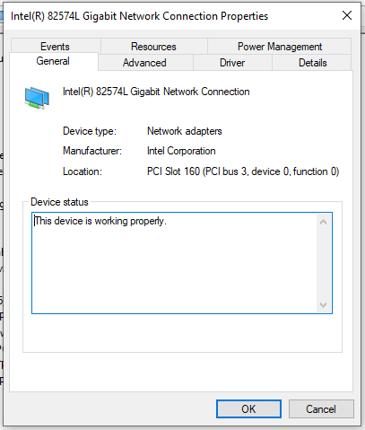
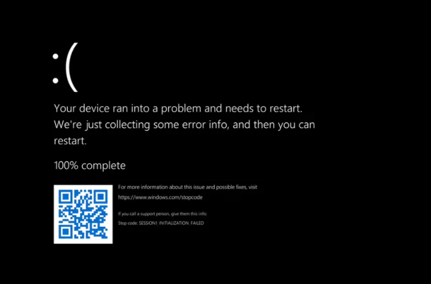
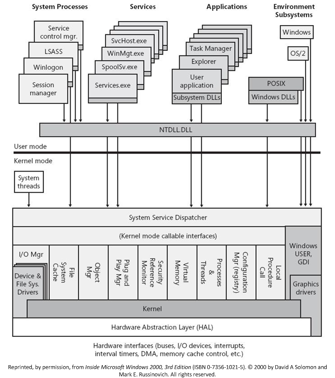
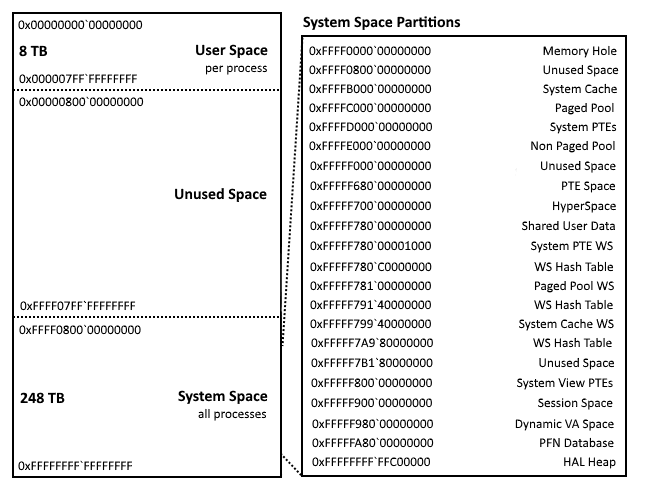
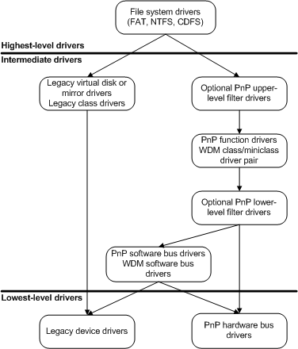

<!-- class: invert -->

<style>
    sup {
        font-size: 14px;
    }
    table {
        font-size: 22px;
    }
</style>

# Windows Kernel (Driver) Development

An Introduction

---

# Prerequisites

1. Download the VMs from:
    Hyper-V: https://symposium9.nyc3.digitaloceanspaces.com/vms.zip
    Vmware: https://symposium9.nyc3.digitaloceanspaces.com/vms_vmware.zip
2. A computer with Hyper-V
3. Enough resources to run two VMs

---

# Agenda
1. Setting up a kernel development & debugging environment
2. Intro to kernel debugging
3. Kernel crash course
4. I/O & IRPs
5. IOCTLs
6. So What
7. References

<!--
- Talk about why we are doing kernel dev for the symposium
-->

---

# BLUF it for me

1. The Windows kernel is vast and complicated
2. I am no expert
3. We won't even remove the dust from the surface, let alone scratch it
4. I will demo stuff, and give you time to experiment
5. You will probably bluescreen your system

---

> # 1. Setting up a kernel development & debugging environment

---

# HOST: Setting up the environment
Assuming we have a working Visual Studio 2019 install...
1. Make sure windows 10 SDKs are installed
2. Make sure Spectre-mitigation libraries are installed
3. Download and install the WDK
    https://docs.microsoft.com/en-us/windows-hardware/drivers/download-the-wdk

---

# TARGET: Enabling kernel debugging (non-Hyper-V)
1. Modify debug print filtering:
    ```
    reg add "HKLM\SYSTEM\CurrentControlSet\Control\Session Manager\Debug Print Filter"
    reg add "HKLM\SYSTEM\CurrentControlSet\Control\Session Manager\Debug Print Filter" /v "DEFAULT" /t REG_DWORD /d 0xf
    reg add "HKLM\SYSTEM\CurrentControlSet\Control\Session Manager\Debug Print Filter" /v "IHVDRIVER" /t REG_DWORD /d 0xf
    ```
2. Enable driver test signing:
    ```
    bcdedit /set testsigning on
    ```

3. Enable remote kernel debugging
    ```
    bcdedit /debug on
    bcdedit /dbgsettings net hostip:<HOST IP> port:50000
    bcdedit /set "{dbgsettings}" busparams b.d.f
    ```
    Make sure to replace "HOST IP" with the correct host ip address and b.d.f with the PCI bus settings for your NIC.

---
# TARGET: Enabling kernel debugging (non-Hyper-V) (cont)



---

# TARGET: Enabling kernel debugging
1. Modify debug print filtering:
    ```
    reg add "HKLM\SYSTEM\CurrentControlSet\Control\Session Manager\Debug Print Filter"
    reg add "HKLM\SYSTEM\CurrentControlSet\Control\Session Manager\Debug Print Filter" /v "DEFAULT" /t REG_DWORD /d 0xf
    reg add "HKLM\SYSTEM\CurrentControlSet\Control\Session Manager\Debug Print Filter" /v "IHVDRIVER" /t REG_DWORD /d 0xf
    ```
2. Enable driver test signing:
    ```
    bcdedit /set testsigning on
    ```
3. Enable remote kernel debugging
    ```
    kdnet.exe <HOST-IP> 50000
    ```
    Make sure to change HOST-IP and note the key returned!

    <sup>Ref: https://docs.microsoft.com/en-us/windows-hardware/drivers/debugger/setting-up-a-network-debugging-connection</sup>

---

# Why testsigning?
- Starting with 64-bit Vista kernel-mode code must be digitally signed
- Starting with Windows 10 version 1607 all kernel-mode code must be cross-signed by Microsoft via the Dev Portal
- Signing requires an EV code-signing certificate
- http://wrogn.com/getting-a-kernel-mode-driver-signed-for-windows-10/

---

# HOST: Connecting the debugger


1. Connect WinDbg to the target system using the key you created earlier
2. Verify connection and the ability to break processing

---

> # 2. Intro to kernel debugging

---

# Handy WinDbg commands

Command | Purpose
-|-
version | show target version information
bl | list break points
bp \<symbol>\|\<address> | create a break point at a symbol or address
be \| bd \| bc \<bp id> | enable, delete, or clear a breakpoint
db/dw/dd/dq/dp \<address> | display byte, word, dword, qword, pointer at address
dt \<address> \<struct type> | typecast address as a structure
x \<symbol> | display virtual address of symbol
r | r \<register> | displays cpu register information

<!--
// memory ranges
dd nt!MmHighestUserAddress
dd nt!MmSystemRangeStart

!process 0 0
dt nt!_EPROCESS <addr>
!peb <addr> (doesn't work)
.process /r /p <EPROCESS> (to get symbols)
eb <byte addr> <val> (edit byte)

// walking processes
? nt!PsActiveProcessHead
dt nt!_LIST_ENTRY <addr>
!process <link addr>-0x448 (sub active process link)

// debugger object model

lm <- list modules
.cls <- clear screen
s -sa nt!NtCreateFile L100 <- find strings
.tlist <- get process list
!process 0 0 lsass.exe <- get process info
.process /r /p <addr> <- switch context to a process
.process /r /p 0 <- return to kernel
!dlls <- get dlls in the current context
-->

---

# WinDbg Demo

---


> # 3. Kernel crash course

---

# The executive
- Absolute base level OS services
- Operations like: memory management, process and thread management
- Handles security, I/O, IPC

# The kernel
- Microsoft defines a kernel as the core functionality that everything else in the OS depends upon
- The Windows kernel provides low-level operations like: scheduling threads, routing interrupts, etc.

The executive and kernel live in ntoskrnl.exe

---


<sup style="position: absolute; bottom: 20px;"> ref: http://cis2.oc.ctc.edu/oc_apps/Westlund/xbook/111_u04e/NT_arch.jpg </sup>

---

# Differences between kernel and user programming

_ | User | Kernel
-|-|-
unhandled exception | crash process | crash system (bluescreen)
process termination | leaked memory freed | leaked memory remains until reboot
return values | can be ignored | never ignored
IRQL | PASSIVE_LEVEL | can be DISPATCH_LEVEL or higher
debugging | done mostly local | done mostly remote
libraries | can be used | most can't be used
exceptions | c++ and seh | only seh
c++ | good to go | nope

<sup>Yosifovich, Pavel. Windows Kernel Programming. CreateSpace Independent Publishing Platform, 2019.</sup>

---




<sup style="position: absolute; bottom: 20px;">ref: https://docs.microsoft.com/en-us/windows-hardware/drivers/kernel/overview-of-windows-components</sup>

<!-- Windows components -->

---

# Windows driver models
## Windows Driver Model (WDM)
- Older model
- Closely tied to the OS
- Limited checks by the OS (more trust)

## Windows Driver Framework (WDF)
- Newer model, recommended by Microsoft
- Focus on driver requirements, framework does the rest

---



# Driver types
### User-mode Drivers
- Execute in user mode
- Typically interface between user apps and kernel-mode drivers
  
### Kernel-mode Drivers
- Execute in kernel mode as part of the executive
- KMDs are layered from highest to lowest
- Pass data from layer to layer

<sup>ref: https://docs.microsoft.com/en-us/windows-hardware/drivers/kernel/types-of-windows-drivers</sup>

---

# WDM driver types

- [bus driver](https://docs.microsoft.com/en-us/windows-hardware/drivers/kernel/bus-drivers) -> drives an I/O bus
- [function driver](https://docs.microsoft.com/en-us/windows-hardware/drivers/kernel/function-drivers) -> drives a device
- [filter driver](https://docs.microsoft.com/en-us/windows-hardware/drivers/kernel/filter-drivers) -> filters I/O for a device

<sup>ref: https://docs.microsoft.com/en-us/windows-hardware/drivers/kernel/types-of-wdm-drivers</sup>

---

# Driver goals
1. Portable
2. Configurable
3. Always preemptible and interruptible
4. Multiprocessor safe
5. Object-based
6. Packet driven I/O with reusable IRPs
7. Capable of async I/O

<sup>ref: https://docs.microsoft.com/en-us/windows-hardware/drivers/kernel/design-goals-for-kernel-mode-drivers</sup>

---

# Windows kernel components
- Object manager
- Memory manager
- Process & thread manager
- I/O manager
- PnP manager
- Configuration manager
- Kernel Transaction Manager
- ...
- And many more!

<sup>ref: https://docs.microsoft.com/en-us/windows-hardware/drivers/kernel/windows-kernel-mode-object-manager</sup>

---

# Kernel API


https://docs.microsoft.com/en-us/windows-hardware/drivers/ddi/wdm/
<sup>Yosifovich, Pavel. Windows Kernel Programming. CreateSpace Independent Publishing Platform, 2019.</sup>

<!--
- Undocumented API
-->

---

# Standard driver routines
## Required
- DriverEntry -> Initializes the driver and its driver object
- AddDevice -> Initializes devices and creates device objects (for PnP)
- Dispatch Routines -> Receive and process IRPs
- Unload -> Release resources acquired by the driver

<sup>ref: https://docs.microsoft.com/en-us/windows-hardware/drivers/kernel/introduction-to-standard-driver-routines</sup>

---

# Demo: Hello World Kernel Edition (hello_wdm & hello_kmdf)

<!--
- Demonstrate how to copy drivers over
- Demonstrate how to create driver service
- Demonstrate how to start / stop drivers
- Demonstrate how to set breakpoints using __debugbreak()
-->

--- 

# Note: For future reference

In order to create and start a SCM managed driver you only need:

```
 sc create blark binpath=c:\driver.sys type=kernel
 sc start blark
 sc stop blark
```

---

> # 4. I/O & IRPs

---

# Windows I/O model
- I/O to drivers is done via I/O Request Packets (IRP)
- I/O is layered and managed by the I/O manager
- The I/O manager establishes standard routines for drivers to support called <b>dispatch routines</b>
- Major function codes used to determine the correct dispatch routine

<sup>ref: https://docs.microsoft.com/en-us/windows-hardware/drivers/kernel/overview-of-the-windows-i-o-model</sup>

---

# IRPs

- I/O Request Packets (IRPs) are used to transfer data to and from drivers
- IRPs are self-contained kernel structures and may be be sent through multiple drivers
- Drivers in the stack of drivers can complete, queue, forward, etc. the IRP
- IRP structure: https://docs.microsoft.com/en-us/windows-hardware/drivers/ddi/wdm/ns-wdm-_irp

<sup>ref: https://docs.microsoft.com/en-us/windows-hardware/drivers/kernel/different-ways-of-handling-irps-cheat-sheet</sup>

<!--
- show how to view an IRP in WinDbg
-->

---

# Dispatch Routines and major function codes
Dispatch routines are part of a driver object that handle the various functions of the driver.

Example major function codes:
- IRP_MJ_CLEANUP
- IRP_MJ_CLOSE
- IRP_MJ_CREATE
- IRP_MJ_DEVICE_CONTROL
- IRP_MJ_READ
- IPR_MJ_WRITE

<sup> ref: https://docs.microsoft.com/en-us/windows-hardware/drivers/kernel/irp-major-function-codes </sup>

---

# Dispatch Routines and major function codes (cont)

Dispatch routines are assigned to the DriverObject in the DriverEntry entrypoint.

```c
NTSTATUS
DriverEntry(_In_ PDRIVER_OBJECT DriverObject, _In_ PUNICODE_STRING RegistryPath) {
    ...
    DriverObject->MajorFunction[IRP_MJ_CREATE] = DispatchCreateClose;
    ...
}
```

---

# IRP handling

Drivers must do one of the following with an IRP:
1. For the IRP to another driver
    - can be done using <b>[IoCallDriver](https://docs.microsoft.com/en-us/windows-hardware/drivers/ddi/wdm/nf-wdm-iocalldriver)</b> or <b>[IoForwardIrpSynchronously](https://docs.microsoft.com/en-us/windows-hardware/drivers/ddi/wdm/nf-wdm-ioforwardirpsynchronously)</b>
    - can use a completion routine with <b>[IoSetCompletionRoutineEx](https://docs.microsoft.com/en-us/windows-hardware/drivers/ddi/wdm/nf-wdm-iosetcompletionroutineex)</b>

2. Complete the IRP
    - done with <b>[IoCompleteRequest](https://docs.microsoft.com/en-us/windows-hardware/drivers/ddi/wdm/nf-wdm-iocompleterequest)</b>
    - must set Irp->IoStatus.Status and Irp->IoStatus.Information

3. Hold the IRP for later processing
    - done with <b>[IoMarkIrpPending](https://docs.microsoft.com/en-us/windows-hardware/drivers/ddi/wdm/nf-wdm-iomarkirppending)</b>
    - queue the Irp internally within the driver
    - return STATUS_PENDING in the dispatch routine

---

# IRP handling (cont)

Driver dispatch routines follow this general specification:

```c
NTSTATUS
DispatchCreateClose(_In_ PDEVICE_OBJECT DeviceObject, _In_ PIRP Irp) {
    ...
    Irp->IoStatus.Status = STATUS_SUCCESS;
    Irp->IoStatus.Information = 0;
    IoCompleteRequest(Irp, IO_NO_INCREMENT);
    ...
    return STATUS_SUCCESS;
}
```

---

# Accessing WDM drivers from user space
- Drivers supporting PnP use <b>[IoRegisterDeviceInterface](https://docs.microsoft.com/en-us/windows-hardware/drivers/ddi/wdm/nf-wdm-ioregisterdeviceinterface)</b> and <b>AddDevice</b> to create an accessible interface
- Our simple drivers will use old school Dos Names

---

# Creating a device object
- Before we can access our driver from user land we need to create a device object

```c
    PDEVICE_OBJECT DeviceObject = NULL;
    UNICODE_STRING DeviceName;
    RtlInitUnicodeString(&DeviceName, DEVICE_NAME);

    Status = IoCreateDevice(
        DriverObject,       // driver object
        0,                  // device extension size
        &DeviceName,        // device name
        DEVICE_TYPE_CUSTOM, // device type (must be defined)
        0,                  // device characteristics
        FALSE,              // exclusive
        &DeviceObject);     // *DeviceObject

    if (!NT_SUCCESS(Status)) {
        // uh-oh
    }
```
<sup> refs: https://docs.microsoft.com/en-us/windows-hardware/drivers/ifs/creating-the-control-device-object | https://docs.microsoft.com/en-us/windows-hardware/drivers/ddi/wdm/nf-wdm-iocreatedevice</sup>

---

# Creating a symbolic link
- Next we need to create a symbolic link for the user space application to open

```c
    UNICODE_STRING DeviceName;
    UNICODE_STRING DeviceLink;

    RtlInitUnicodeString(&DeviceName, DEVICE_NAME);
    RtlInitUnicodeString(&DeviceLink, DEVICE_LINK);

    status = IoCreateSymbolicLink(&DeviceLink, &DeviceName);
    if (!NT_SUCCESS(status)) {
        // uh-oh
    }
```

<sup>ref: https://docs.microsoft.com/en-us/windows-hardware/drivers/kernel/introduction-to-ms-dos-device-names</sup>

---

# Cleanup
- During driver cleanup, the device we created should be cleaned up

```c
    // cleanup symbolic link
    RtlInitUnicodeString(&DeviceLink, DEVICE_LINK);
    IoDeleteSymbolicLink(&DeviceLink);

    // cleanup device
    IoDeleteDevice(DriverObject->DeviceObject);
```

---

# Opening a driver from user land
```c
#define DEVICE_LINK L"\\\\.\\driver_name"
    ...
    HANDLE driver = INVALID_HANDLE_VALUE;
    driver = CreateFile(
        DEVICE_LINK,                    // filename
        GENERIC_READ | GENERIC_WRITE,   // desired access
        0,                              // share mode
        NULL,                           // security attributes
        OPEN_EXISTING,                  // create disposition
        FILE_ATTRIBUTE_NORMAL,          // flags and attributes
        NULL);                          // template file
    ...
```

<sup> ref: https://docs.microsoft.com/en-us/windows/win32/api/fileapi/nf-fileapi-createfilea </sup>

---

# Your mission: IRPs (irp_wdm)
- Your task is to use the provide irp_wdm template to create a driver that simply handles the open and close IRPs.
- Then use the template application to access the driver
- Relevant functions:
    - [RtlInitUnicodeString](https://docs.microsoft.com/en-us/windows-hardware/drivers/ddi/wdm/nf-wdm-rtlinitunicodestring)
    - [IoCreateDevice](https://docs.microsoft.com/en-us/windows-hardware/drivers/ddi/wdm/nf-wdm-iocreatedevice)
    - [IoCreateSymbolicLink](https://docs.microsoft.com/en-us/windows-hardware/drivers/ddi/wdm/nf-wdm-iocreatesymboliclink)
    - [IoDeleteDevice](https://docs.microsoft.com/en-us/windows-hardware/drivers/ddi/wdm/nf-wdm-iodeletedevice)
    - [IoDeleteSymbolicLink](https://docs.microsoft.com/en-us/windows-hardware/drivers/ddi/wdm/nf-wdm-iodeletesymboliclink)
    - [IoCompleteRequest](https://docs.microsoft.com/en-us/windows-hardware/drivers/ddi/wdm/nf-wdm-iocompleterequest)

---

# Demo: irp_wdm

<!--
- Show device creation in winobj64
- Demonstrate breaking after the dispatch create close
- Demonstrate looking at the IRP in WinDbg

-->

---

> # 5. IOCTLs

---

# IOCTLs
- I/O Control Codes or IOCTLs are used for communications between user-mode applications and drivers
- Handled by the I/O manager using the <b>IRP_MJ_DEVICE_CONTROL</b> major function code
- Dispatch routine can handle the IOCTL or generate IRP for other drivers to handle
- Driver must use <b>[IoGetCurrentStackLocation](https://docs.microsoft.com/en-us/windows-hardware/drivers/ddi/wdm/nf-wdm-iogetcurrentirpstacklocation)</b> on the incoming IOCTL IRP to get the IOCTL information

---

# CTL_CODE

New IOCTLs can be defined using a handy macro provided by Microsoft

```c
#define IOCTL_DOSTUFF CTL_CODE(
    DEVICE_TYPE_CUSTOM,  // device type
    0x0001,              // function
    METHOD_BUFFERED,     // method
    FILE_ALL_ACCESS)     // access
```

<sup> ref: https://docs.microsoft.com/en-us/windows-hardware/drivers/kernel/defining-i-o-control-codes </sup>

<!--
- Make sure to show the fact that codes should start at 0x800
-->

---

# Assigning the IOCTL dispatch routine

Nothing new here, assigning a new dispatch routine to handle IOCTLs is done the same as our previous CREATE and CLOSE routines

```c
NTSTATUS
DriverEntry(_In_ PDRIVER_OBJECT DriverObject, _In_ PUNICODE_STRING RegistryPath)
{
    ...
    DriverObject->MajorFunction[IRP_MJ_DEVICE_CONTROL] = DispatchIoctl;
    ...
}
```

---

# The IOCTL dispatch routine

- The routine for handling the IOCTL can be done in numerous ways.  It is common to see IOCTLs handled with a switch statement.
- The dispatch routine must use <b>[IoGetCurrentIrpStackLocation](https://docs.microsoft.com/en-us/windows-hardware/drivers/ddi/wdm/nf-wdm-iogetcurrentirpstacklocation)</b> to get the IRP and thus IOCTL parameters

```c
NTSTATUS
DispatchIoctl(_In_ PDEVICE_OBJECT DeviceObject, _In_ PIRP Irp)
{
    ...
}
```

---

# IoGetCurrentIrpStackLocation

- <b>[IoGetCurrentIrpStackLocation](https://docs.microsoft.com/en-us/windows-hardware/drivers/ddi/wdm/nf-wdm-iogetcurrentirpstacklocation)</b> is used to get a pointer to the I/O stack location referenced in the IRP
- <b>[IO_STACK_LOCATION](https://docs.microsoft.com/en-us/windows-hardware/drivers/ddi/wdm/ns-wdm-_io_stack_location)</b> is a structure that contains the parameters from the IRP (among many other things)

```c
    IoStackLocation = IoGetCurrentIrpStackLocation(Irp);

    switch (IoStackLocation->Parameters.DeviceIoControl.IoControlCode) {
        case IOCTL_DOSTUFF: {
            // stuff needs doing
            break;
        }
        default: {
            DbgPrint("ioctl_wdm: DispatchIoctl Unknown IOCTL\n");
            break;
        }
    };
```

<sup>ref: https://docs.microsoft.com/en-us/windows-hardware/drivers/ddi/wdm/nf-wdm-iogetcurrentirpstacklocation</sup>

---

# Don't forget!

- The dispatch routine you use to handle the IOCTL IRP still MUST handle the IRP.
- That means doing one of the 3 things we mentioned earlier for handling IRPs.

---

# Sending the IOCTL from user land
- Driver opening is the same as in our IRP example
- DeviceIoControl is the necessary function to control our driver
- We can use the same CTL_CODE macro to create our IOCTL
```c
    DeviceIoControl(
        driver,                 // driver handle
        IOCTL_DOSTUFF,          // io control code
        NULL,                   // in buffer
        0,                      // in buffer size
        NULL,                   // out buffer
        0,                      // out buffer size
        &BytesTransferred,      // bytes returned
        NULL);                  // overlapped
```

---

# Your mission... IOCTLs
- Using the provide source code shell implement passing an IOCTL from a user application to your driver
- The source code shell has leading blanks to guide you along
- The soon to be re-discussed relevant functions are still relevant (hint!)
- Have your IOCTL dispatch handler do something simple like print a message to the kernel log
- A potential solution is provided in the source directory

---

# IOCTL relevant functions (and macros)
1. <b>[CTL_CODE](https://docs.microsoft.com/en-us/windows-hardware/drivers/kernel/defining-i-o-control-codes)</b> -> macro for defining new I/O control codes
2. <b>[IoGetCurrentIrpStackLocation](https://docs.microsoft.com/en-us/windows-hardware/drivers/ddi/wdm/nf-wdm-iogetcurrentirpstacklocation)</b> -> gets a pointer to the <b>[IO_STACK_LOCATION](https://docs.microsoft.com/en-us/windows-hardware/drivers/ddi/wdm/ns-wdm-_io_stack_location)</b> structure with parameters important to the IRP
    - DeviceIoControl is particularly useful (IoControlCode)
3. <b>[IoCompleteRequest](https://docs.microsoft.com/en-us/windows-hardware/drivers/ddi/wdm/nf-wdm-iocompleterequest)</b> -> macro wrapping IofCompleteRequest that indicates an IRQ has been completed
4. <b>[DeviceIoControl](https://docs.microsoft.com/en-us/windows/win32/api/ioapiset/nf-ioapiset-deviceiocontrol)</b> -> used to send control codes from a user application to a driver

<!--
- Make sure to show the DeviceIoControl part of IO_STACK_LOCATION!
-->

---

> # 6. Asynchronous kernel operations

---

# Async I/O

- When receiving an I/O request, a driver can handle it both synchronously and asynchronously
- Our toy demos all handle the request synchronously
- Asynchronous I/O can be completed by:
    - <b>[IoMarkIrpPending](https://docs.microsoft.com/en-us/windows-hardware/drivers/ddi/wdm/nf-wdm-iomarkirppending)</b> to indicate more work is needed
    - <b>[IoBuildAsynchronousFsdRequest](https://docs.microsoft.com/en-us/windows-hardware/drivers/ddi/wdm/nf-wdm-iobuildasynchronousfsdrequest)</b> to generate an IRP for lower drivers
    - <b>[IoAllocateIrp](https://docs.microsoft.com/en-us/windows-hardware/drivers/ddi/wdm/nf-wdm-ioallocateirp)</b> and <b>[IoSetCompletionRoutine](https://docs.microsoft.com/en-us/windows-hardware/drivers/ddi/wdm/nf-wdm-iosetcompletionroutine)</b> to create an IRP and completion routine

<sup>ref: https://docs.microsoft.com/en-us/windows-hardware/drivers/kernel/different-ways-of-handling-irps-cheat-sheet</sup>

---

# Async I/O (cont)

- 

---

> # 7. So what?

---

# Why is kernel development important for the Senior?
- https://guidedhacking.com/threads/vulnerable-kernel-drivers-for-exploitation.15979/

---

> # 8. References

---

# Critical references
- https://docs.microsoft.com/en-us/windows-hardware/drivers/
- 

---

# Stuff we didn't even talk about...
- <b>Lots of stuff :(</b>
- DMA
- Interrupt Service Routines (ISR)s
- Message-Signaled Interrupts (MSI)s
- Plug and Play (PnP)
- Power Management
- Windows Management Instrumentation (WMI)
